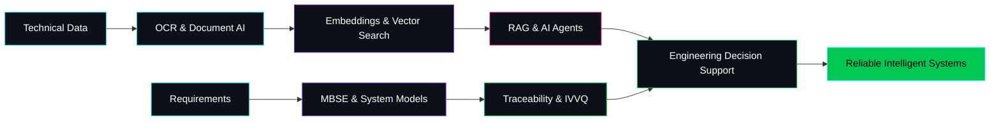

<div align="center">


# DORIAN AMRI

[](https://git.io/typing-svg)

**I connect artificial intelligence with mission-critical engineering.**

[](https://www.linkedin.com/in/dorian-amri-8685a2177/)
[](mailto:amri.dk@hotmail.com)
[](https://www.google.com/maps/place/Toulouse)
[](https://github.com/Amrid-lab)


</div>

---

## Engineering intelligence into complex systems

AI & Systems Engineer working at the intersection of **Generative AI**, **systems engineering** and **aerospace**. I build solutions that extract knowledge from technical documents, structure complex data and support reliable engineering decisions.

<div align="center">


</div>

```text
AI / GenAI          -> OCR, NLP, RAG, AI agents, ML and Deep Learning
Systems             -> MBSE, SysML, requirements, traceability and IVVQ
Industrialisation   -> APIs, MLOps, containers, CI/CD and cloud platforms
Domain              -> Avionics, Flight Warning, defence and electronics
```

> My approach: combine the speed of AI with the discipline of systems engineering.

---

## 🏆 Featured Achievements

### 🚀 CNES - Generation ISS Project
**Designed and prepared scientific experiment for International Space Station**
- Led reliability analysis and constraint studies for space mission protocols
- Coordinated multidisciplinary team for experimental engineering
- Contributed to device reliability and technical presentation

### 🏥 AI Clinical Decision Support
**Built ML prototype for patient anomaly detection with 95% accuracy**
- Developed deep learning model for functional diagnosis support
- Created personalized physiotherapy recommendation system
- Achieved 95% anomaly detection accuracy on patient data

### 🛡️ Aerospace RAMS Engineering
**Contributed to EGNOS V2 system safety analyses at APSYS/Airbus**
- Performed reliability, availability, maintainability and safety studies
- Participated in technical reviews and system validation documentation
- Worked on critical satellite navigation system safety

---

## What I build

| | Focus | Outcome |
|:---:|---|---|
| **01** | **Intelligent document systems** | Process 50,000+ technical documents with 95% accuracy, reducing analysis time by 70% using OCR, RAG and AI agents. |
| **02** | **Production-oriented AI** | Deploy RAG systems serving 500+ engineers daily with APIs, containers, model tracking and cloud-ready delivery. |
| **03** | **Complex system models** | Structure requirements across engineering lifecycle with MBSE, SysML and traceability matrices. |
| **04** | **Technical data platforms** | Process 10M+ sensor data points monthly for distributed analytics and decision support. |

---

## AI systems blueprint



---

## 💻 Code Highlights

### RAG Architecture Pattern
```python
# Document Processing Pipeline
documents = load_technical_docs()
chunks = split_documents(documents)
embeddings = create_embeddings(chunks)
vector_store = FAISS.from_embeddings(embeddings)
retriever = vector_store.as_retriever()
```

### MBSE Requirements Traceability
```python
# SysML to Code Generation
requirements = parse_sysml_requirements()
traceability = build_traceability_matrix(requirements)
validation = run_ivvq_tests(traceability)
```

---

## Technology radar

<div align="center">

### AI & Generative AI


### Data, MLOps & Cloud


### Systems & Engineering


</div>

---

## 📂 Project Portfolio

### 🤖 AI & GenAI Projects

#### Enterprise RAG & AI Agent Platform
Document intelligence pipeline combining ingestion, chunking, embeddings, vector retrieval, LLM orchestration and API serving for technical knowledge. **Serving 500+ engineers daily with 95% accuracy.**

`Python` `Hugging Face` `LangChain` `FAISS / Chroma` `FastAPI` `Docker` `CI/CD`

#### AI Clinical Decision Support
Machine Learning prototype for anomaly detection, functional diagnosis support and personalised physiotherapy recommendations. **95% anomaly detection accuracy on patient data.**

`Machine Learning` `Deep Learning` `Anomaly Detection` `Recommendation`

### 📊 Data Analytics Projects

[](https://github.com/Amrid-lab/SpotifyAnalysis)
**Interactive R-Shiny dashboard for artist and song data analysis with advanced visualizations**

[](https://github.com/Amrid-lab/ShopperSentimentsAnalysis)
**Customer review analysis dashboard with sentiment mining and trend detection**

[](https://github.com/Amrid-lab/la-crime-analytics-dashboard)
**Los Angeles crime data visualization dashboard with geospatial analysis and temporal trends**

### 🔧 Engineering Projects

#### Predictive Maintenance & Big Data Platform
Cloud-ready architecture for distributed sensor processing, experiment tracking, model serving and operational reporting. **Processing 10M+ sensor data points monthly.**

`Spark` `PySpark` `Databricks` `MLflow` `Azure` `Power BI`

[](https://github.com/Amrid-lab/toulouse-bars-web-scraper)
**Python web scraping and data extraction system for Toulouse bars with interactive map visualization**

---

## 🛤️ My Journey

```text
2020  DUT Mesures Physiques → IRAP Internship (Electronics)
      ↓
2022  CESI Engineering → Continental (PCB Testing)  
      ↓
2023  IA School Master → ALTEN (MBSE & AI)
      ↓
2026  AKKODIS → Naval Group (IVVQ) → ATR (Flight Warning)
      ↓
NOW   AI & Systems Engineer at AKKODIS x ATR
```

---

## 🎓 Education

### Master AI & Big Data (2023-2025)
**IA School Toulouse** - Apprenticeship
- Specialization: R, Python, SQL, Power BI, Data Visualization
- Focus: Machine Learning, Deep Learning, NLP, RAG
- Double competence: Data Science & Systems Engineering

### Engineering Curriculum (2022-2023)  
**CESI Toulouse** - 1-year apprenticeship
- Embedded Electrical & Electronic Systems
- Focus: Systems engineering and practical applications

### DUT Physical Measurements (2018-2020)
**IUT Paul Sabatier Toulouse**
- Physics, electronics, measurements
- Scientific instrumentation and data analysis

### Scientific Baccalaureate (2015-2018)
**Lycée Saint-Exupéry**
- Science specialization with honors

---

## 💡 What Drives Me

### 🌌 **Space Exploration**
Long-standing passion for astrophysics and space missions. Contributed to CNES ISS project for International Space Station experiments.

### 🧠 **AI + Engineering**
Believe in combining AI speed with systems discipline for reliable intelligent systems. The future belongs to those who can bridge both worlds.

### 🚀 **Innovation**
Focus on building solutions that bridge the gap between experimentation and production. Transform complex data into actionable engineering decisions.

### 🎯 **Mission-Critical Systems**
Passionate about applying AI to aerospace, defence and safety-critical systems where reliability matters most.

---

## Mission log

```text
2026 - now   AKKODIS x ATR          Avionics Systems Engineer - Flight Warning
2026         AKKODIS x Naval Group  Systems IVVQ Engineer
2023 - 2025  ALTEN                  Systems Engineer - MBSE & AI
2022 - 2023  Continental            PCB Test Application Engineer
2021 - 2022  APSYS / Airbus         RAMS Engineering Intern
2020         IRAP                   Electronics Engineering Intern
```

---

## Why this combination matters

| AI mindset | Systems discipline | Engineering reality |
|:---:|:---:|:---:|
| Explore new models and architectures | Specify, trace and validate | Deliver for aerospace and defence contexts |
| Extract knowledge from complex data | Control interfaces and requirements | Work across software, electronics and operations |
| Prototype rapidly | Build explainable processes | Keep reliability at the centre |

---

## GitHub signal

<div align="center">


</div>

---

## Go deeper

<div align="center">

[](https://github.com/Amrid-lab/Amrid-lab/raw/main/CV_Dorian-Amri.pdf)
[](https://github.com/Amrid-lab/Amrid-lab/raw/main/CVeng_Dorian-Amri.pdf)
[](https://github.com/Amrid-lab/Amrid-lab/raw/main/Dorian_Amri_Data_AI.pdf)
[](https://github.com/Amrid-lab/Amrid-lab/raw/main/Dorian_Amri_Data_AI_eng.pdf)

### THINK IN SYSTEMS. BUILD WITH INTELLIGENCE.


</div>